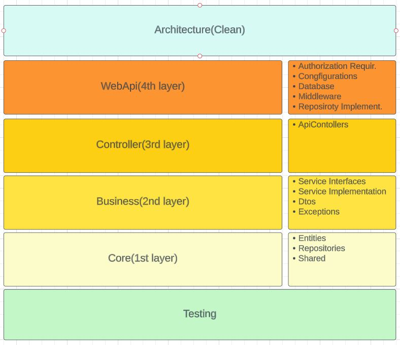

# Fullstack Project


This project involves creating a Fullstack project with React and Redux on the frontend and ASP.NET Core 7 on the backend. The goal is to provide a seamless experience for users, along with robust management system for administrators.

- Frontend: SASS, TypeScript, React, Redux Toolkit
- Backend: ASP .NET Core, Entity Framework Core, PostgreSQL

# Introduction

This repository contains the code for Stefanos Kapsoritakis' Fullstack project. 
- Link to frontpage: [Frontend Project](stefanosfullstack.netlify.app)
- Link to Web Api page. [Api Webpage](https://stefanos-ecommerce.azurewebsites.net/swagger/index.html)
Endpoints:

- /api/v1/auth

- /api/v1/orders

- /api/v1/products

- /api/v1/users

## Technologies

- TypeScript
- React
- MaterialUI
- React Router Dom
- Redux toolkit
- C# 
- .Net Core
- EF Core
- PostgreSQL

## Entity Relation Diagram
The image below shows the database ERD. Showing 5 tables their connection and relations. 

## Project Architecture
Following the Clean Architecture system. The image below displays the all the players and their files inside them.

## Project Features
The image below contains all the actions and restrictions for each feature.

##  Project Structure
````
O:.
│   .gitignore
│   Architectur.JPG
│   ERD.JPG
│   Features.JPG
│   README.md
│
├───backend
│   │   order.http
│   │   product.http
│   │   user.http
│   │   WebApi.sln
│   │
│   ├───WebApi.Business
│   │   │   WebApi.Business.csproj
│   │   │   WebApi.Business.sln
│   │   │
│   │   └───src
│   │       ├───Abstractions
│   │       │       IAuthService.cs
│   │       │       IBaseService.cs
│   │       │       IOrderProductService.cs
│   │       │       IOrderService.cs
│   │       │       IProductService.cs
│   │       │       IUserService.cs
│   │       │
│   │       ├───Dtos
│   │       │       OrderDto.cs
│   │       │       OrderProductDto.cs
│   │       │       ProductDto.cs
│   │       │       UserDto.cs
│   │       │
│   │       ├───Implementation
│   │       │       BaseService.cs
│   │       │       OrderProductService.cs
│   │       │       OrderService.cs
│   │       │       ProductService.cs
│   │       │       UserService.cs
│   │       │
│   │       └───Shared
│   │               AuthService.cs
│   │               CustomeException.cs
│   │               PasswordService.cs
│   │
│   ├───WebApi.Controller
│   │   │   WebApi.Controller.csproj
│   │   │
│   │   └───src
│   │       └───Controllers
│   │               AuthController.cs
│   │               CrudController.cs
│   │               OrderController.cs
│   │               ProductController.cs
│   │               UserController.cs
│   │
│   ├───WebApi.Core
│   │   │   WebApi.Core.csproj
│   │   │   WebApi.Core.sln
│   │   │
│   │   └───src
│   │       ├───Abstractions
│   │       │       IBaseRepo.cs
│   │       │       IOrderProductRepo.cs
│   │       │       IOrderRepo.cs
│   │       │       IProductRepo.cs
│   │       │       IUserRepo.cs
│   │       │
│   │       ├───Entities
│   │       │       BaseEntity.cs
│   │       │       BaseEntityWithId.cs
│   │       │       Image.cs
│   │       │       Order.cs
│   │       │       OrderProduct.cs
│   │       │       Product.cs
│   │       │       User.cs
│   │       │
│   │       └───Shared
│   │               QueryOptions.cs
│   │
│   ├───WebApi.Test
│   │   │   Usings.cs
│   │   │   WebApi.Test.csproj
│   │   │   WebApi.Test.sln
│   │   └───src
│   │       └───Business.Test
│   │           ├───Products
│   │           │       ProductImplementationTest.cs
│   │           │
│   │           └───Users
│   │                   UserImplementationTest.cs
│   │
│   └───WebApi.WebApi
│       │   appsettings.Development.json
│       │   appsettings.json
│       │   WebApi.WebApi.csproj
│       │
│       ├───Migrations
│       │       20230816142450_DatabaseCreate.cs
│       │       20230816142450_DatabaseCreate.Designer.cs
│       │       DatabaseContextModelSnapshot.cs
│       │
│       ├───Properties
│       │       launchSettings.json
│       │
│       └───src
│           │   Program.cs
│           │
│           ├───AuthorizationRequirement
│           │       OwnerAuthorization.cs
│           │
│           ├───Configuration
│           │       MapperProfile.cs
│           │
│           ├───Database
│           │       DatabaseContext.cs
│           │       TimeStampInterceptor.cs
│           │
│           ├───Middleware
│           │       ErrorHandlerMiddleware.cs
│           │
│           └───RepoImpementations
│                   BaseRepo.cs
│                   OrderProductRepo.cs
│                   OrderRepo.cs
│                   ProductRepo.cs
│                   UserRepo.cs
│
└───frontend
    │   package.json
    │   tsconfig.json
    │
    ├───public
    │       favicon.ico
    │       index.html
    │       logo192.png
    │       logo512.png
    │       manifest.json
    │       robots.txt
    │
    └───src
        │   App.tsx
        │   index.css
        │   index.tsx
        │   logo.svg
        │   react-app-env.d.ts
        │   reportWebVitals.ts
        │   setupTests.ts
        │
        ├───components
        │       CartList.tsx
        │       CreateProduct.tsx
        │       NavBar.tsx
        │       ProductDetails.tsx
        │       ProductsList.tsx
        │       RemoveProduct.tsx
        │       SignIn.tsx
        │       SignUp.tsx
        │       UpdateProduct.tsx
        │       withLoading.tsx
        │
        ├───hooks
        │       useAppDispatch.ts
        │       useAppSelector.ts
        │
        ├───pages
        │       Cart.tsx
        │       DeleteProduct.tsx
        │       EditProduct.tsx
        │       Home.tsx
        │       Login.tsx
        │       NewProduct.tsx
        │       NotFound.tsx
        │       Products.tsx
        │       Profile.tsx
        │       Register.tsx
        │       SingleProduct.tsx
        │       UsersList.tsx
        │
        ├───redux
        │   │   store.ts
        │   │
        │   ├───common
        │   │       imageUpload.ts
        │   │
        │   └───reducers
        │           cartReducer.ts
        │           productsReducer.ts
        │           usersReducer.ts
        │
        ├───routes
        │       Routes.tsx
        │
        ├───tests
        │   ├───components
        │   │       SignUp.test.tsx
        │   │
        │   ├───data
        │   │       categories.ts
        │   │       products.ts
        │   │       users.ts
        │   │
        │   ├───reducers
        │   │       productsReducer.test.ts
        │   │       usersReducer.test.ts
        │   │
        │   ├───servers
        │   │       productServer.ts
        │   │       userServer.ts
        │   │
        │   └───shared
        │           store.ts
        │
        └───types
                Cart.ts
                Category.ts
                NewProduct.ts
                NewUser.ts
                Product.ts
                ProductUpdate.ts
                User.ts
                UserCredential.ts
                UserUpdate.ts
````
